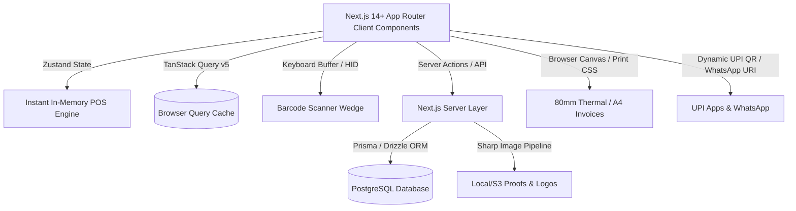

# 🖨️ Crystal Press — Billing & Management System

> **High-Performance Retail Counter POS & Custom Job Management ERP**  
> Built for **Crystal Press** (Printing Press + Stationery Retail — ~1,500 SKUs, Single Store).

---

## 🧭 Core Architectural Directives

This project is governed by **strict performance, design, and structural rules** to ensure:
1. **Zero-Lag POS Counter Experience**: Sub-50ms barcode scanning, instantaneous cart recalculations, keyboard-first operations.
2. **Human-Crafted UI/UX (Non-AI Vibe)**: Distinctive design system inspired by modern soft-lime & slate dashboard aesthetics (Lodgify-style card layouts, soft badges, micro-interactions, refined typography).
3. **Optimized PostgreSQL Database**: Deeply indexed for 1,500+ SKUs, job order workflows, audit trails, and concurrent point-of-sale transactions.
4. **Optimized Assets & Native Print Engine**: Zero-overhead 80mm/58mm thermal receipt printing and A4 invoice generation, with WebP image processing for printing press design proofs.

---

## 📚 Standard Documentation Suite

All development prompts, agent chats, and code implementations **must strictly comply** with the following documentation files located in `/docs`:

| File | Purpose & Contents | Primary Focus |
| :--- | :--- | :--- |
| **[`01_PROJECT_SPECIFICATION.md`](file:///d:/Desktop/NEXT/crystalpress/docs/01_PROJECT_SPECIFICATION.md)** | Master business requirements, user roles, feature checklist (Modules 0–13), and dual retail/job order flows. | Requirements & Flows |
| **[`02_DATABASE_ARCHITECTURE.md`](file:///d:/Desktop/NEXT/crystalpress/docs/02_DATABASE_ARCHITECTURE.md)** | Complete PostgreSQL / Prisma schema, Trigram & B-Tree indexing strategy, concurrency locks, audit logs, and performance query patterns. | Database & Speed |
| **[`03_UI_UX_DESIGN_SYSTEM.md`](file:///d:/Desktop/NEXT/crystalpress/docs/03_UI_UX_DESIGN_SYSTEM.md)** | Visual design language, color tokens (Lime/Sage/Slate), Shadcn UI styling rules, anti-"AI UI" principles, and dual POS/Desktop layout specs. | Visuals & Layout |
| **[`04_FRONTEND_PERFORMANCE.md`](file:///d:/Desktop/NEXT/crystalpress/docs/04_FRONTEND_PERFORMANCE.md)** | TanStack Query v5 caching, Zustand zero-latency cart state, 1,500+ SKU virtualization, hardware barcode scanner wedge listener, and keyboard shortcuts. | Frontend & Zero-Lag |
| **[`05_ASSET_AND_PRINT_OPTIMIZATION.md`](file:///d:/Desktop/NEXT/crystalpress/docs/05_ASSET_AND_PRINT_OPTIMIZATION.md)** | Client & server image compression (WebP/Sharp), proof attachments, raw ESC-POS/CSS thermal receipt engine, and A4 print templates. | Assets & Printing |
| **[`06_API_AND_INTEGRATIONS.md`](file:///d:/Desktop/NEXT/crystalpress/docs/06_API_AND_INTEGRATIONS.md)** | Server actions, route handlers, dynamic UPI QR generation, WhatsApp instant bill dispatch, data export/backup protocols. | APIs & Services |
| **[`07_DEVELOPER_CHECKLIST_AND_RULES.md`](file:///d:/Desktop/NEXT/crystalpress/docs/07_DEVELOPER_CHECKLIST_AND_RULES.md)** | **Mandatory checklist for every chat/session** before writing code, code conventions, strict TypeScript & Zod validation standards. | Chat Checklist & Rules |

---

## 🛠️ Technology Stack Overview

- **Framework**: Next.js 14+ (App Router, Server Actions, Route Handlers)
- **Language**: TypeScript (Strict Mode)
- **Database**: PostgreSQL with `pg_trgm` & B-Tree indexes
- **ORM**: Prisma ORM with connection pooling
- **UI & Styling**: Tailwind CSS + Shadcn UI (Radix UI primitives) + Lucide React Icons + Framer Motion
- **State Management**: Zustand (In-memory POS Cart) + TanStack React Query v5 (Server State)
- **Catalog Virtualization**: `@tanstack/react-virtual` (1,500+ products table & grid)
- **Validation**: Zod schema validation on client & server boundaries

---

## ⚡ Quick Rules for Developers & AI Agents

1. **Check the Checklist**: Always read [`docs/07_DEVELOPER_CHECKLIST_AND_RULES.md`](file:///d:/Desktop/NEXT/crystalpress/docs/07_DEVELOPER_CHECKLIST_AND_RULES.md) before implementing any feature.
2. **Never Write Slow Queries**: Every product search query must hit the composite trigram/SKU indexes defined in [`docs/02_DATABASE_ARCHITECTURE.md`](file:///d:/Desktop/NEXT/crystalpress/docs/02_DATABASE_ARCHITECTURE.md).
3. **No Generic "AI Templates"**: Strictly implement the custom theme, badge pills, rounded cards, and clean typography defined in [`docs/03_UI_UX_DESIGN_SYSTEM.md`](file:///d:/Desktop/NEXT/crystalpress/docs/03_UI_UX_DESIGN_SYSTEM.md).
4. **Instant Counter Interactions**: All cart additions, barcode scans, and total recalculations must be client-side instantaneous with zero server roundtrips until final checkout.
