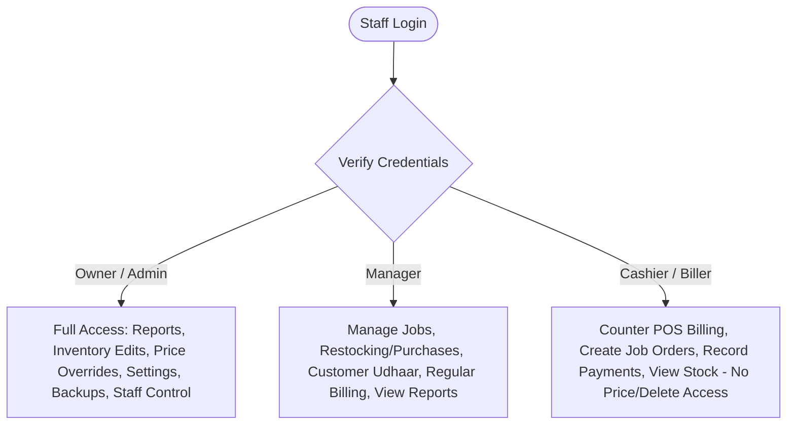
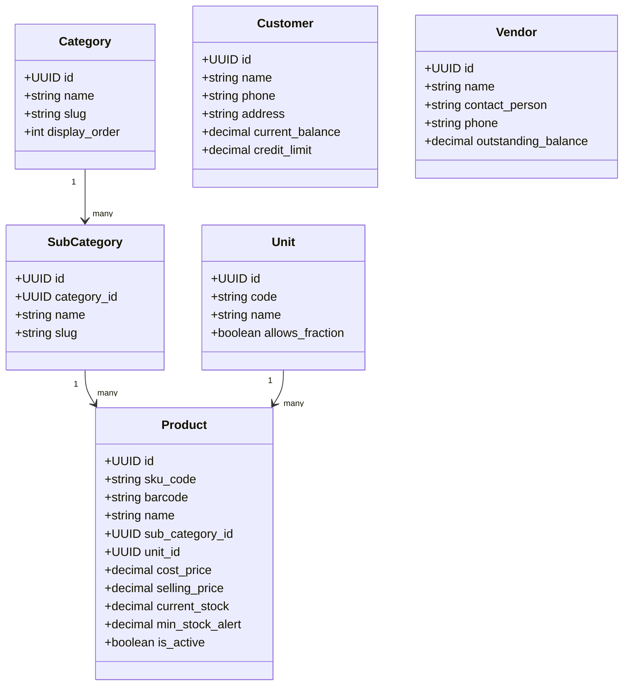
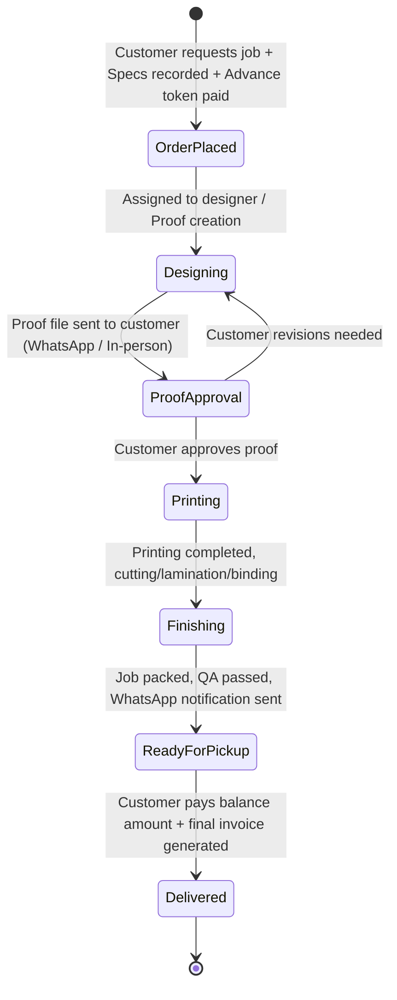
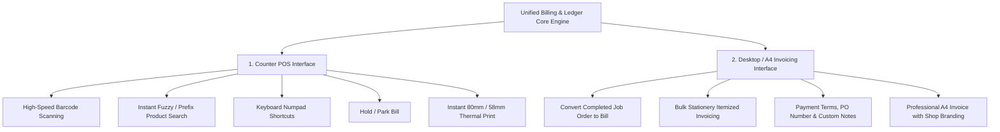
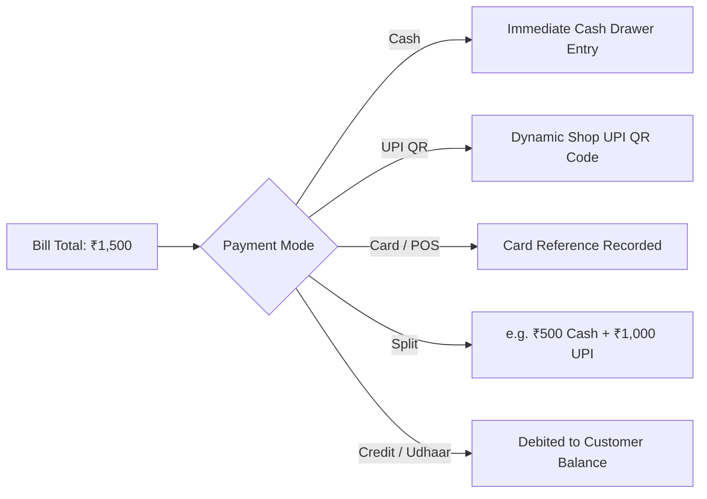

# 📋 01. Project Specification & Business Blueprint

> **System**: Crystal Press — Billing & Management ERP  
> **Target Environment**: Single-Store Retail Counter + Printing Press Job Production  
> **Database**: PostgreSQL | **Framework**: Next.js 14+ (App Router) | **Styling**: Tailwind + Shadcn UI

---

## 1. Project Profile & Business Context

| Parameter | Specification | Details |
| :--- | :--- | :--- |
| **Business Name** | **Crystal Press** | Printing press job works + Stationery retail shop. |
| **Product Varieties** | **~1,500 Active SKUs** | Requires fast category/sub-category navigation, instant barcode lookups, and trigram search. |
| **Store Topology** | **Single Store** | No multi-branch or inter-store transfer overhead; single tenant, ultra-lean latency. |
| **Tax / GST Status** | **Not Registered (Unregistered)** | Default bill has 0% tax; system includes a flexible flat tax toggle (0% / 5% / 12% / 18%) per item/bill for future proofing. |
| **Users / Staff** | **~3 Concurrent Staff** | Role-based: Owner (Admin), Cashier (Counter Biller), Manager. |
| **Hardware Targets** | **Counter POS & Desktop PC** | Dual-mode UI: 80mm/58mm thermal receipt printer + standard A4 laser printer + USB/Wireless Barcode Scanner (HID). |
| **Payments** | **Cash + UPI + Card + Credit (Udhaar)** | 90%+ transactions via Cash/UPI; Customer ledger tracking for regular commercial clients. |

---

## 2. User & Access Management Matrix

### Role Permissions

| Feature / Action | Owner / Admin | Manager | Cashier / Biller |
| :--- | :---: | :---: | :---: |
| **Counter POS Billing** | ✅ | ✅ | ✅ |
| **Create & Edit Job Orders** | ✅ | ✅ | ✅ |
| **Record Customer Payments & Advance** | ✅ | ✅ | ✅ |
| **View Live Product Stock & Prices** | ✅ | ✅ | ✅ (Read Only) |
| **Modify Product Selling & Cost Prices** | ✅ | ✅ | ❌ |
| **Delete Invoices / Cancel Invoices** | ✅ | ❌ (Request Admin) | ❌ |
| **View Profit & Margin Reports** | ✅ | ❌ | ❌ |
| **View Daily Sales & Cash Split** | ✅ | ✅ | ✅ (Own Shift) |
| **Vendor Purchase Entry & Restocking** | ✅ | ✅ | ❌ |
| **System Settings, Logo, Backup** | ✅ | ❌ | ❌ |
| **Manage Staff Accounts** | ✅ | ❌ | ❌ |

> **Audit Logging Requirement**: Every invoice cancellation, price override, discount addition, stock adjustment, and refund MUST record the `user_id`, `timestamp`, `ip_address`, `action_type`, `old_value`, and `new_value`.

---

## 3. Master Data Architecture

### Key Master Entities:
1. **Category & Sub-Category**: Hierarchical navigation (`Stationery` → `Pens & Markers`, `Paper & Boards`, `Printing Consumables`, `Office Supplies`).
2. **Units of Measure (UOM)**: `pcs` (Pieces), `ream` (500 sheets paper), `box`, `pkt` (Packet), `roll`, `dozen`, `sq_ft` (for flex/banners).
3. **Products (1,500 SKUs)**: Fast indexed search by name, SKU (`PEN-001`), and barcode (`8901234567890`). Supports automatic low-stock triggers.
4. **Customers**: Walk-in default customer (`WALK-IN`) vs registered commercial/corporate clients with credit accounts and purchase history.
5. **Vendors / Suppliers**: Paper mills, wholesale stationery distributors with balance tracking.

---

## 4. Custom Job Orders (Printing Press Specific Workflow)

Printing press operations differ fundamentally from plain retail counter sales. Orders are bespoke with multi-step production timelines.

### Job Order Specifications Model:
- **Job Types**: Visiting Cards, Wedding / Invitation Cards, Banners / Flex, Brochures & Pamphlets, Bill Books / Letterheads, ID Cards & Lanyards, Custom Stickers / Labels, Envelopes.
- **Parametric Fields**:
  - `size`: e.g., 3.5" x 2", A4, 12" x 18", 10ft x 4ft.
  - `paper_type`: 300 GSM Art Card, 350 GSM Gloss, Linen Texture, Metallic Sheet, 70 GSM Bond, Flex Vinyl.
  - `colors`: 4+0 (Single side color), 4+4 (Both sides color), 1+0 (Single color offset), Spot UV.
  - `finishing`: Gloss Lamination, Matte Lamination, Thermal Embossing, Die Cut, Creasing, Spiral Binding.
  - `quantity`: Number of units (e.g., 500 cards, 2 banners, 10 bill books).
- **Proof & File Attachments**: Image/PDF proofs stored with optimized thumbnails.
- **Advance & Balance Financials**:
  $$\text{Total Job Amount} = \text{Design Fee} + \text{Production Amount}$$
  $$\text{Balance Due} = \text{Total Job Amount} - \text{Advance Paid}$$

---

## 5. Billing & Invoicing Engine (Dual Mode)

The software shares a **single unified transaction & inventory engine** with two tailored presentation interfaces:

### Billing Capabilities:
- **Auto-Increment Invoice Numbering**: Configurable prefix + sequential sequence (e.g., `CP-2026-0001`).
- **Bill Hold / Park**: Park up to 10 active counter bills in local storage/DB while another customer is attended to.
- **Discounts**: Item-level discount (Flat / %) and Invoice-level discount (Flat / %).
- **Round-Off**: Automatic round-off calculation to the nearest rupee.
- **Duplicate & Reprint**: One-click reprint of past invoices with clear watermark `[DUPLICATE COPY]`.

---

## 6. Payments & Credit (Udhaar) Management

### Udhaar / Credit Tracking:
- Track outstanding balance per regular customer.
- Configurable **Credit Limit** with soft warning when exceeded.
- Customer Ledger Statement: chronological history of all invoices, payments, returns, and balance running total.
- Payment Collection Screen: Record ad-hoc customer payments against total outstanding balance with WhatsApp receipt confirmation.

---

## 7. Purchases, Restocking & Spoilage

1. **Vendor Purchase Orders**:
   - Record vendor shipments (Paper reams, ink cartridges, binding coils, pens).
   - Enter vendor invoice number, received quantity, and purchase cost price.
   - Automatically updates current stock and recalculates average or latest cost price.
2. **Stock Adjustment & Spoilage**:
   - Printing operations frequently encounter paper wastage, print misalignments, or shelf damage.
   - Dedicated **Stock Spoilage Entry**: Deduct damaged quantity with reason code (`PRINT_MISALIGN`, `PAPER_JAM`, `EXPIRY_DAMAGE`, `STOCK_TAKE_VARIANCE`).
3. **Low-Stock Alert Engine**:
   - Visual dashboard badges for items falling below `min_stock_alert`.
   - Filterable one-click "Restock Purchase Requisition" list.

---

## 8. Tax Configuration (Simple & Optional)

- **Default State**: 0% Tax (Unregistered). Invoices display subtotal, discount, round-off, and net total cleanly without confusing GST lines.
- **Optional Switch**: Global or per-item Tax Rate field (e.g., 5%, 12%, 18%).
- **Future Growth**: If Crystal Press registers for GST in the future, toggling GST mode immediately activates HSN code columns, CGST/SGST/IGST breakdown, and GSTIN formatting without code alterations.

---

## 9. Reports & Business Intelligence Dashboard

Inspired by modern executive dashboards (Lodgify style), the dashboard gives real-time visibility into:
1. **Today's Financial KPI Cards**: Total Sales, Cash vs. UPI vs. Card split, Total Collected, Total Credit Issued.
2. **Operational KPI Cards**: Active Job Orders in Production, Completed Jobs Awaiting Delivery, Low-Stock SKUs (< Threshold).
3. **Visual Charts**:
   - **Sales Trend Area Chart** (Daily, 7 Days, Monthly Revenue curve with gradient fill).
   - **Payment Modes Donut Chart** (Cash vs UPI vs Card vs Udhaar breakdown).
   - **Top 5 Fast-Moving Products** (Horizontal progress bars).
4. **Recent Activity Timeline**: Real-time stream of latest counter bills, completed jobs, and payment collections.

---

## 10. Notifications & WhatsApp Integration

- **Zero-Cost WhatsApp Share**: Generates standard encoded `https://wa.me/{phone}?text={encoded_message}` URLs:
  - **Instant Bill Share**: Sends itemized summary + public printable web invoice link to customer WhatsApp with one click.
  - **Job Ready Notification**: Sends automatic pickup alert: *"Dear {Customer}, your order for {Job Type} (Qty: {Qty}) is ready for pickup at Crystal Press. Balance due: ₹{Balance}. Thank you!"*
- **Cloud API Readiness**: Clean abstraction layer so WhatsApp Cloud API / Twilio can be hooked in without breaking changes.

---

## 11. Security, Audit & Backups

- **Local Storage + PostgreSQL Transaction Safety**: ACID compliant transaction blocks for all checkout operations.
- **Automated Backup Protocol**:
  - One-click manual backup download (JSON + SQL Dump).
  - Nightly automated PostgreSQL export task.
- **Immutable Financial Logs**: Invoices cannot be deleted silently. Voiding or modifying an invoice generates a compensating audit log entry.
