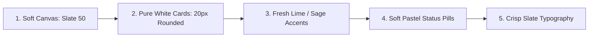
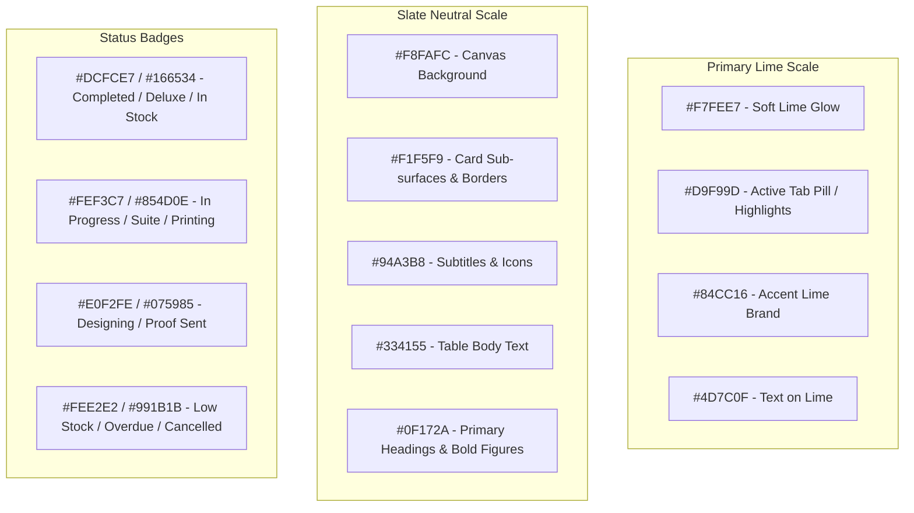
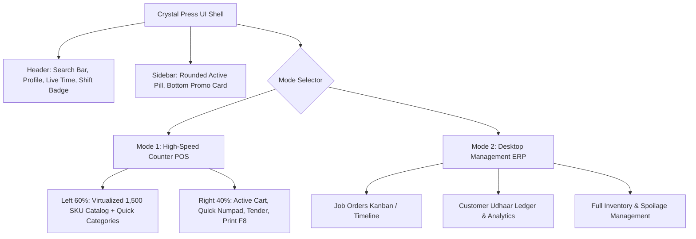

# 🎨 03. UI/UX Design System & Style Guide

> **Visual Direction**: Inspired by Modern Executive Dashboard Aesthetics (Lodgify Style)  
> **Core Objective**: A bespoke, human-crafted, tactile interface that completely avoids generic "AI-generated" boilerplate aesthetics.  
> **Tech Stack**: Tailwind CSS + Shadcn UI (Radix UI Primitives) + Lucide React Icons + Framer Motion.

---

## 1. Visual Identity & Aesthetic Principles

The UI reflects a clean, bright, high-clarity environment built for all-day counter billing and production tracking without visual fatigue.



### Visual Signature:
- **Canvas & Surface**: Soft, warm tinted background (`#F8FAFC`) with crisp pure white elevated cards (`#FFFFFF`).
- **Accent Identity**: Fresh chartreuse/lime (`#D9F99D` / `#84CC16`) and deep forest slate (`#0F172A`) giving a distinctive, premium stationery & printing press character.
- **Card Geometry**: High corner radius (`rounded-2xl` to `rounded-3xl` / 16px–24px) paired with delicate micro-borders (`border-slate-100` / `border-slate-200/60`).
- **Elevation**: Multi-layered ambient drop shadows (`shadow-[0_2px_12px_rgba(0,0,0,0.03)]`) rather than heavy dark shadows.
- **Micro-Interactions**: Smooth hover state transitions, active pill indicators, and subtle scale feedback on buttons.

---

## 2. Color Palette & Design Tokens



### 2.1 CSS Variables Configuration (`globals.css`)

```css
@tailwind base;
@tailwind components;
@tailwind utilities;

@layer base {
  :root {
    /* Canvas & Backgrounds */
    --background: 210 40% 98%;      /* #F8FAFC */
    --foreground: 222 47% 11%;      /* #0F172A */
    
    /* Card & Surfaces */
    --card: 0 0% 100%;              /* #FFFFFF */
    --card-foreground: 222 47% 11%;
    --popover: 0 0% 100%;
    --popover-foreground: 222 47% 11%;

    /* Brand Accents (Chartreuse / Fresh Lime) */
    --primary: 84 81% 44%;          /* #84CC16 */
    --primary-foreground: 0 0% 100%;
    --primary-light: 84 81% 92%;    /* #ECFCCB */
    --primary-hover: 84 81% 38%;

    /* Secondary Neutral */
    --secondary: 210 40% 96.1%;     /* #F1F5F9 */
    --secondary-foreground: 222 47% 11%;

    /* Muted Text & Borders */
    --muted: 210 40% 96.1%;
    --muted-foreground: 215.4 16.3% 46.9%; /* #64748B */
    --border: 214.3 31.8% 91.4%;    /* #E2E8F0 */
    --input: 214.3 31.8% 91.4%;
    --ring: 84 81% 44%;

    /* Status Pill Accents */
    --badge-success-bg: 142 76% 95%; /* #DCFCE7 */
    --badge-success-fg: 142 76% 22%; /* #15803D */
    --badge-warning-bg: 48 96% 89%;  /* #FEF3C7 */
    --badge-warning-fg: 38 92% 30%;  /* #A16207 */
    --badge-danger-bg: 0 86% 94%;   /* #FEE2E2 */
    --badge-danger-fg: 0 74% 42%;   /* #B91C1C */
    --badge-info-bg: 199 89% 94%;    /* #E0F2FE */
    --badge-info-fg: 199 89% 28%;    /* #0369A1 */

    /* Card Radius */
    --radius: 1.25rem; /* 20px for modern organic cards */
  }
}
```

---

## 3. Key UI Component Blueprints

### 3.1 Stat / KPI Card (Lodgify Style)
Each KPI card contains a large crisp number, a subtle upper label, a pastel icon container on the top-right, and a comparison percentage pill at the bottom:

```tsx
// components/dashboard/StatCard.tsx
interface StatCardProps {
  title: string;
  value: string;
  icon: React.ReactNode;
  iconBg?: string; // e.g. "bg-emerald-50 text-emerald-600"
  changeText: string;
  changeType: "positive" | "negative" | "neutral";
}

export function StatCard({ title, value, icon, iconBg = "bg-lime-100 text-lime-800", changeText, changeType }: StatCardProps) {
  return (
    <div className="bg-white rounded-3xl p-6 border border-slate-100 shadow-[0_2px_12px_rgba(0,0,0,0.03)] hover:shadow-[0_4px_20px_rgba(0,0,0,0.06)] transition-all">
      <div className="flex items-start justify-between">
        <div>
          <span className="text-xs font-semibold text-slate-400 tracking-wider uppercase">{title}</span>
          <div className="text-3xl font-bold text-slate-900 mt-2 tracking-tight">{value}</div>
        </div>
        <div className={`p-3 rounded-2xl ${iconBg}`}>
          {icon}
        </div>
      </div>
      
      <div className="mt-4 flex items-center gap-2">
        <span className={`inline-flex items-center gap-1 text-xs font-medium px-2.5 py-0.5 rounded-full ${
          changeType === "positive" ? "bg-emerald-50 text-emerald-700" :
          changeType === "negative" ? "bg-rose-50 text-rose-700" :
          "bg-slate-100 text-slate-600"
        }`}>
          {changeText}
        </span>
        <span className="text-xs text-slate-400">from yesterday</span>
      </div>
    </div>
  );
}
```

### 3.2 Custom Status Badge Pill
Pill components with circular dot indicator and soft tinted pastel background:

```tsx
// components/ui/StatusBadge.tsx
export function StatusBadge({ status }: { status: string }) {
  const configs: Record<string, { bg: string; text: string; dot: string; label: string }> = {
    DELUXE: { bg: "bg-lime-100/70", text: "text-lime-900", dot: "bg-lime-500", label: "Deluxe" },
    READY_FOR_PICKUP: { bg: "bg-emerald-100", text: "text-emerald-800", dot: "bg-emerald-500", label: "Ready" },
    PRINTING: { bg: "bg-amber-100", text: "text-amber-800", dot: "bg-amber-500", label: "Printing" },
    DESIGNING: { bg: "bg-sky-100", text: "text-sky-800", dot: "bg-sky-500", label: "Designing" },
    LOW_STOCK: { bg: "bg-rose-100", text: "text-rose-800", dot: "bg-rose-500", label: "Low Stock" },
  };

  const c = configs[status] || { bg: "bg-slate-100", text: "text-slate-700", dot: "bg-slate-400", label: status };

  return (
    <span className={`inline-flex items-center gap-1.5 px-3 py-1 rounded-full text-xs font-semibold ${c.bg} ${c.text}`}>
      <span className={`w-1.5 h-1.5 rounded-full ${c.dot}`} />
      {c.label}
    </span>
  );
}
```

### 3.3 Multi-Segment Metric Bar (Room Availability / Stock Pipeline Style)
Visualizing inventory or job progress with segmented colored blocks:

```tsx
// components/dashboard/SegmentedMetricBar.tsx
export function StockAvailabilityBar({ inStock, lowStock, outOfStock }: { inStock: number; lowStock: number; outOfStock: number }) {
  const total = inStock + lowStock + outOfStock || 1;
  const inStockPct = (inStock / total) * 100;
  const lowStockPct = (lowStock / total) * 100;
  const outOfStockPct = (outOfStock / total) * 100;

  return (
    <div className="bg-white rounded-3xl p-6 border border-slate-100 shadow-[0_2px_12px_rgba(0,0,0,0.03)]">
      <div className="flex items-center justify-between mb-4">
        <h3 className="text-base font-bold text-slate-800">Inventory Status</h3>
        <span className="text-xs text-slate-400">1,500 Total SKUs</span>
      </div>

      {/* Progress segmented track */}
      <div className="h-4 w-full bg-slate-100 rounded-full flex overflow-hidden gap-1 p-0.5">
        <div style={{ width: `${inStockPct}%` }} className="bg-emerald-400 rounded-l-full h-full transition-all duration-500" />
        <div style={{ width: `${lowStockPct}%` }} className="bg-lime-300 h-full transition-all duration-500" />
        <div style={{ width: `${outOfStockPct}%` }} className="bg-rose-400 rounded-r-full h-full transition-all duration-500" />
      </div>

      {/* Metric Breakdown Grid */}
      <div className="grid grid-cols-3 gap-4 mt-6 pt-4 border-t border-slate-50">
        <div>
          <span className="text-xs text-slate-400 font-medium">In Stock</span>
          <div className="text-xl font-bold text-slate-800 mt-1">{inStock}</div>
        </div>
        <div>
          <span className="text-xs text-slate-400 font-medium">Low Stock</span>
          <div className="text-xl font-bold text-amber-600 mt-1">{lowStock}</div>
        </div>
        <div>
          <span className="text-xs text-slate-400 font-medium">Out of Stock</span>
          <div className="text-xl font-bold text-rose-600 mt-1">{outOfStock}</div>
        </div>
      </div>
    </div>
  );
}
```

---

## 4. Dual Workspace Layout Architecture



### Counter POS Layout Specifications:
- **Zero Distraction**: Sidebar collapses or switches to icon-only mode to maximize billing real estate.
- **Large Action Buttons**: Payment buttons (Cash, UPI QR, Credit) are large (`min-h-[56px]`) with bold legible amounts for rapid touch and mouse interaction.
- **Fixed Cart Summary**: Cart footer stays pinned to the bottom right with instantaneous tax, discount, round-off, and net payable calculations.

---

## 5. Anti-"AI Generated" Design Checklist

Every page created for Crystal Press **must pass** these craft criteria:

| Anti-Pattern (AI Stereotype) | Mandatory Crystal Press Standard |
| :--- | :--- |
| ❌ Generic blue/indigo buttons (`bg-blue-600`). | ✅ Custom brand palette: Soft lime active highlights (`#D9F99D`), forest slate buttons (`bg-slate-900 text-white`). |
| ❌ Standard harsh square cards (`rounded-md`). | ✅ Organically rounded cards (`rounded-3xl` or `rounded-2xl`). |
| ❌ Overcrowded walls of plain gray text. | ✅ Clear typographic hierarchy: Bold headings, uppercase micro-labels, subtle secondary text (`text-slate-400`). |
| ❌ Raw unstyled native HTML tables. | ✅ Modern styled tables: Soft gray header, rounded row hover states, colored status pill badges. |
| ❌ Generic empty state illustrations. | ✅ Clean contextual empty states with quick-action trigger buttons (e.g., "Scan barcode or press F2 to search"). |
| ❌ Cluttered modals with tiny inputs. | ✅ Spacious dialogs with clear primary/cancel buttons, autofocus on primary field, and keyboard escape. |
