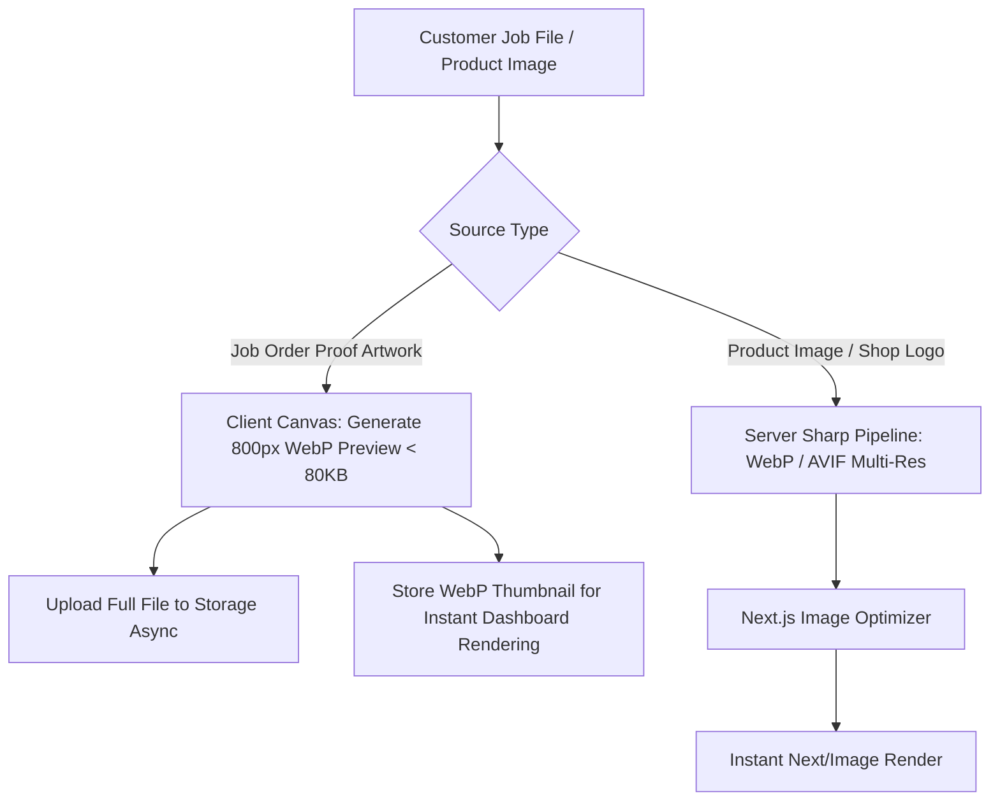
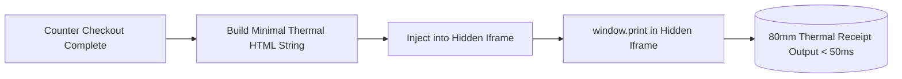

# 🖨️ 05. Asset, Image & Print Engine Optimization

> **Performance Mandate**: Zero bandwidth bloat, instantaneous image previews, and sub-100ms thermal receipt & A4 invoice printing without heavy runtime overhead.  
> **Key Technologies**: Sharp + WebP/AVIF + Next/Image + Client Pre-compression + Native CSS Print Engine (80mm/58mm & A4).

---

## 1. Media & Image Optimization Pipeline

Printing presses handle high-resolution customer artwork (visiting card CDR/PDF/TIFF/PNGs up to 50MB). These large files must **never slow down the web interface**.



### 1.1 Client-Side Proof Pre-Compression Before Upload
Compress images in the browser before network transmission to prevent browser freezes:

```typescript
// utils/imageCompression.ts
export async function generateClientThumbnail(file: File, maxWidth = 800, quality = 0.8): Promise<Blob> {
  return new Promise((resolve, reject) => {
    const reader = new FileReader();
    reader.readAsDataURL(file);
    reader.onload = (event) => {
      const img = new Image();
      img.src = event.target?.result as string;
      img.onload = () => {
        const canvas = document.createElement("canvas");
        const scale = Math.min(1, maxWidth / img.width);
        canvas.width = img.width * scale;
        canvas.height = img.height * scale;

        const ctx = canvas.getContext("2d");
        ctx?.drawImage(img, 0, 0, canvas.width, canvas.height);

        canvas.toBlob(
          (blob) => {
            if (blob) resolve(blob);
            else reject(new Error("Thumbnail creation failed"));
          },
          "image/webp",
          quality
        );
      };
      img.onerror = reject;
    };
    reader.onerror = reject;
  });
}
```

### 1.2 Sharp Backend Image Processing Pipeline
When saving shop logos or product thumbnails on the server:

```typescript
// lib/mediaProcessor.ts
import sharp from "sharp";

export async function processProductImage(buffer: Buffer) {
  return sharp(buffer)
    .resize(400, 400, { fit: "inside", withoutEnlargement: true })
    .webp({ quality: 80, effort: 4 })
    .toBuffer();
}
```

---

## 2. High-Speed Native Thermal Print Engine (80mm / 58mm)

Heavy PDF generation libraries (Puppeteer, jsPDF) introduce 1.5s–3s lag per counter checkout.  
Crystal Press uses a **Native Hidden Iframe CSS Print Engine** that prints in **under 50ms**.



### 2.1 80mm Thermal Receipt Template & Print CSS

```tsx
// components/print/ThermalReceiptTemplate.tsx
import React from "react";

export interface ThermalReceiptData {
  shopName: string;
  tagline: string;
  address: string;
  phone: string;
  invoiceNumber: string;
  date: string;
  customerName: string;
  cashierName: string;
  items: Array<{
    name: string;
    qty: number;
    price: number;
    total: number;
  }>;
  subTotal: number;
  discount: number;
  tax: number;
  roundOff: number;
  netTotal: number;
  paymentMethod: string;
  footerText: string;
}

export function generateThermalReceiptHtml(data: ThermalReceiptData): string {
  return `
    <!DOCTYPE html>
    <html>
    <head>
      <meta charset="utf-8" />
      <style>
        @page {
          margin: 0;
          size: 80mm auto;
        }
        body {
          font-family: 'Courier New', Courier, monospace;
          font-size: 12px;
          line-height: 1.2;
          width: 72mm;
          margin: 0 auto;
          padding: 4mm 0;
          color: #000;
        }
        .text-center { text-align: center; }
        .text-right { text-align: right; }
        .bold { font-weight: bold; }
        .header { margin-bottom: 6px; }
        .divider { border-top: 1px dashed #000; margin: 4px 0; }
        .item-table { width: 100%; border-collapse: collapse; margin: 4px 0; }
        .item-table th { border-bottom: 1px dashed #000; font-size: 11px; padding: 2px 0; text-align: left; }
        .item-table td { padding: 2px 0; vertical-align: top; }
        .summary-table { width: 100%; margin-top: 4px; }
        .summary-table td { padding: 1px 0; }
        .footer { margin-top: 8px; font-size: 10px; text-align: center; }
      </style>
    </head>
    <body>
      <div class="header text-center">
        <div class="bold" style="font-size: 16px;">${data.shopName}</div>
        <div>${data.tagline}</div>
        <div>${data.address}</div>
        <div>Tel: ${data.phone}</div>
      </div>
      
      <div class="divider"></div>
      
      <div><strong>Bill No:</strong> ${data.invoiceNumber}</div>
      <div><strong>Date:</strong> ${data.date}</div>
      <div><strong>Customer:</strong> ${data.customerName}</div>
      <div><strong>Cashier:</strong> ${data.cashierName}</div>
      
      <div class="divider"></div>
      
      <table class="item-table">
        <thead>
          <tr>
            <th style="width: 45%;">Item</th>
            <th class="text-right" style="width: 15%;">Qty</th>
            <th class="text-right" style="width: 20%;">Rate</th>
            <th class="text-right" style="width: 20%;">Amt</th>
          </tr>
        </thead>
        <tbody>
          ${data.items
            .map(
              (i) => `
            <tr>
              <td>${i.name}</td>
              <td class="text-right">${i.qty}</td>
              <td class="text-right">${i.price.toFixed(2)}</td>
              <td class="text-right">${i.total.toFixed(2)}</td>
            </tr>
          `
            )
            .join("")}
        </tbody>
      </table>
      
      <div class="divider"></div>
      
      <table class="summary-table">
        <tr>
          <td>Subtotal:</td>
          <td class="text-right">₹${data.subTotal.toFixed(2)}</td>
        </tr>
        ${
          data.discount > 0
            ? `<tr><td>Discount:</td><td class="text-right">-₹${data.discount.toFixed(2)}</td></tr>`
            : ""
        }
        ${
          data.tax > 0
            ? `<tr><td>Tax:</td><td class="text-right">+₹${data.tax.toFixed(2)}</td></tr>`
            : ""
        }
        ${
          data.roundOff !== 0
            ? `<tr><td>Round-off:</td><td class="text-right">${data.roundOff > 0 ? "+" : ""}₹${data.roundOff.toFixed(2)}</td></tr>`
            : ""
        }
        <tr class="bold" style="font-size: 14px;">
          <td>NET TOTAL:</td>
          <td class="text-right">₹${data.netTotal.toFixed(2)}</td>
        </tr>
        <tr>
          <td>Paid (${data.paymentMethod}):</td>
          <td class="text-right">₹${data.netTotal.toFixed(2)}</td>
        </tr>
      </table>
      
      <div class="divider"></div>
      
      <div class="footer">
        <div>${data.footerText}</div>
        <div>Software by Crystal Press</div>
      </div>
    </body>
    </html>
  `;
}
```

### 2.2 Instant Direct Print Trigger Utility
Dispatches print jobs seamlessly without navigating away from the billing screen:

```typescript
// utils/printService.ts
export function printReceipt(htmlContent: string) {
  let iframe = document.getElementById("receipt-print-iframe") as HTMLIFrameElement;
  
  if (!iframe) {
    iframe = document.createElement("iframe");
    iframe.id = "receipt-print-iframe";
    iframe.style.position = "fixed";
    iframe.style.right = "0";
    iframe.style.bottom = "0";
    iframe.style.width = "0px";
    iframe.style.height = "0px";
    iframe.style.border = "none";
    document.body.appendChild(iframe);
  }

  const doc = iframe.contentWindow?.document;
  if (!doc) return;

  doc.open();
  doc.write(htmlContent);
  doc.close();

  iframe.contentWindow?.focus();
  setTimeout(() => {
    iframe.contentWindow?.print();
  }, 50);
}
```

---

## 3. Professional A4 Laser Print Engine

For detailed bulk stationery invoices and custom job orders:
- **Header**: Crystal Press stylized header with contact details and optional QR payment code.
- **Job Card Work Order**: Separate printable production sheet without monetary figures for the printing workshop staff (specifying paper, size, color, finishing).
- **Invoice Layout**: Full-width bordered grid with terms, bank details, and customer signature box.
