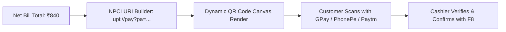

# 🔌 06. API, Payment & Third-Party Integration Blueprint

> **System**: Crystal Press Backend Services & External Integrations  
> **Key Protocols**: Next.js Server Actions + Dynamic UPI QR Engine + WhatsApp Direct URL Dispatcher + Automated Data Backup.

---

## 1. Dynamic UPI QR Payment Engine

Counter billing demands fast online payment reconciliation without waiting for POS terminals.  
The system dynamically encodes the shop's UPI VPA (`shop@upi`), payee name, bill number, and exact payable amount into an NPCI-compliant UPI Intent QR code.



### 1.1 NPCI UPI URI Generator

```typescript
// utils/upiGenerator.ts
export interface UPISpec {
  payeeVpa: string;      // e.g. "crystalpress@icici"
  payeeName: string;     // e.g. "Crystal Press"
  amount: number;        // e.g. 840.00
  transactionRef: string;// e.g. "CP-2026-0492"
  transactionNote?: string;
}

export function generateUPIPaymentUrl({ payeeVpa, payeeName, amount, transactionRef, transactionNote }: UPISpec): string {
  const note = transactionNote || `Bill ${transactionRef}`;
  const params = new URLSearchParams({
    pa: payeeVpa,
    pn: payeeName,
    am: amount.toFixed(2),
    tr: transactionRef,
    tn: note,
    cu: "INR",
  });

  return `upi://pay?${params.toString()}`;
}
```

### 1.2 Counter Display Dynamic QR Component

```tsx
// components/pos/UPIPaymentModal.tsx
import { QRCodeSVG } from "qrcode.react";
import { generateUPIPaymentUrl } from "@/utils/upiGenerator";

interface UPIModalProps {
  amount: number;
  invoiceNumber: string;
  onPaymentConfirmed: (ref: string) => void;
  onCancel: () => void;
}

export function UPIPaymentModal({ amount, invoiceNumber, onPaymentConfirmed, onCancel }: UPIModalProps) {
  const upiUrl = generateUPIPaymentUrl({
    payeeVpa: "crystalpress@okaxis", // Configured from ShopSettings
    payeeName: "Crystal Press",
    amount,
    transactionRef: invoiceNumber,
  });

  return (
    <div className="p-6 bg-white rounded-3xl text-center max-w-sm mx-auto">
      <h3 className="text-lg font-bold text-slate-800">Scan & Pay via UPI</h3>
      <p className="text-xs text-slate-400 mt-1">GPay, PhonePe, Paytm, BHIM</p>
      
      <div className="my-6 p-4 bg-slate-50 rounded-2xl flex justify-center border border-slate-100">
        <QRCodeSVG value={upiUrl} size={180} level="M" />
      </div>

      <div className="text-2xl font-bold text-slate-900 mb-4">₹{amount.toFixed(2)}</div>

      <div className="flex gap-2">
        <button onClick={onCancel} className="flex-1 py-3 rounded-xl border border-slate-200 text-sm font-semibold text-slate-600 hover:bg-slate-50">
          Cancel
        </button>
        <button onClick={() => onPaymentConfirmed("UPI_VERIFIED")} className="flex-1 py-3 rounded-xl bg-slate-900 text-white text-sm font-semibold hover:bg-slate-800">
          Confirm Paid (Enter)
        </button>
      </div>
    </div>
  );
}
```

---

## 2. WhatsApp Notification & Share Engine (Zero Overhead)

Instead of requiring paid API subscriptions from day one, Crystal Press utilizes high-converting standard `wa.me` intent links, with an architectural abstraction ready for WhatsApp Cloud API.

```mermaid
graph TD
    Trigger[Event: Bill Completed / Job Ready / Payment Received] --> MsgBuilder[Build Markdown WhatsApp Template]
    MsgBuilder --> IntentCheck{Channel Mode}
    IntentCheck -->|Default: Direct Web Intent| URLScheme[wa.me/91{phone}?text={encoded}]
    IntentCheck -->|Enterprise: Cloud API| WebhookAPI[POST graph.facebook.com/messages]
```

### 2.1 WhatsApp Notification Templates

```typescript
// utils/whatsappNotification.ts
export function buildBillWhatsAppUrl(phone: string, data: {
  customerName: string;
  invoiceNumber: string;
  netTotal: number;
  itemCount: number;
  publicBillUrl: string;
}): string {
  const cleanPhone = phone.replace(/\D/g, "");
  const formattedPhone = cleanPhone.length === 10 ? `91${cleanPhone}` : cleanPhone;

  const text = `*CRYSTAL PRESS — INVOICE* 🧾
Hello ${data.customerName},
Thank you for visiting Crystal Press!

*Bill No:* ${data.invoiceNumber}
*Items:* ${data.itemCount} items
*Total Amount:* ₹${data.netTotal.toFixed(2)}

📄 *View / Download Your Bill:*
${data.publicBillUrl}

_For any queries, please reply to this number._`;

  return `https://wa.me/${formattedPhone}?text=${encodeURIComponent(text)}`;
}

export function buildJobReadyWhatsAppUrl(phone: string, data: {
  customerName: string;
  jobOrderNumber: string;
  jobType: string;
  quantity: number;
  balanceDue: number;
}): string {
  const cleanPhone = phone.replace(/\D/g, "");
  const formattedPhone = cleanPhone.length === 10 ? `91${cleanPhone}` : cleanPhone;

  const text = `*CRYSTAL PRESS — ORDER READY* 🎉
Hello ${data.customerName},
Your printing order is ready for pickup!

*Order No:* ${data.jobOrderNumber}
*Item:* ${data.jobType} (Qty: ${data.quantity})
*Balance Due on Pickup:* ₹${data.balanceDue.toFixed(2)}

📍 *Pickup Location:*
Crystal Press, Main Road

_Please collect at your convenience during business hours._`;

  return `https://wa.me/${formattedPhone}?text=${encodeURIComponent(text)}`;
}
```

---

## 3. Server Actions & API Route Contracts

### 3.1 Checkout Server Action (`actions/checkout.ts`)
```typescript
"use server";
import { z } from "zod";
import { prisma } from "@/lib/prisma";

const CheckoutItemSchema = z.object({
  productId: z.string().uuid().optional(),
  name: z.string().min(1),
  quantity: z.number().positive(),
  unitPrice: z.number().nonnegative(),
  unitCostPrice: z.number().default(0),
  discountAmount: z.number().default(0),
  taxPercent: z.number().default(0),
  version: z.number().default(0),
});

const CheckoutPayloadSchema = z.object({
  customerId: z.string().uuid().optional(),
  customerName: z.string().default("Walk-in Customer"),
  customerPhone: z.string().optional(),
  items: z.array(CheckoutItemSchema).min(1),
  subTotal: z.number().nonnegative(),
  discountAmount: z.number().default(0),
  taxAmount: z.number().default(0),
  roundOff: z.number().default(0),
  netTotal: z.number().nonnegative(),
  paidAmount: z.number().nonnegative(),
  paymentMethod: z.enum(["CASH", "UPI", "CARD", "CREDIT_UDHAAR", "SPLIT"]),
  transactionRef: z.string().optional(),
});

export async function processCounterCheckout(userId: string, payload: z.infer<typeof CheckoutPayloadSchema>) {
  const validated = CheckoutPayloadSchema.parse(payload);

  return await prisma.$transaction(async (tx) => {
    // 1. Generate sequential bill number
    const count = await tx.invoice.count();
    const invoiceNumber = `CP-${new Date().getFullYear()}-${String(count + 1).padStart(5, "0")}`;

    // 2. Decrement stock atomically with version check
    for (const item of validated.items) {
      if (item.productId) {
        const res = await tx.product.updateMany({
          where: {
            id: item.productId,
            currentStock: { gte: item.quantity },
          },
          data: {
            currentStock: { decrement: item.quantity },
          },
        });

        if (res.count === 0) {
          throw new Error(`Item ${item.name} does not have sufficient stock.`);
        }

        // Record stock adjustment log
        await tx.stockAdjustment.create({
          data: {
            productId: item.productId,
            adjustmentType: "SALE_DEDUCTION",
            quantityDelta: -item.quantity,
            previousStock: 0, // Recorded in trigger or view
            newStock: 0,
            reasonNotes: `Invoice ${invoiceNumber}`,
            userId,
          },
        });
      }
    }

    const balanceDue = Math.max(0, validated.netTotal - validated.paidAmount);

    // 3. Create Invoice & line items
    const invoice = await tx.invoice.create({
      data: {
        invoiceNumber,
        invoiceType: "POS_COUNTER",
        customerId: validated.customerId,
        customerName: validated.customerName,
        customerPhone: validated.customerPhone,
        subTotal: validated.subTotal,
        discountAmount: validated.discountAmount,
        taxAmount: validated.taxAmount,
        roundOff: validated.roundOff,
        netTotal: validated.netTotal,
        paidAmount: validated.paidAmount,
        balanceDue,
        paymentMethod: validated.paymentMethod,
        createdById: userId,
        items: {
          create: validated.items.map((i) => ({
            productId: i.productId,
            itemDescription: i.name,
            quantity: i.quantity,
            unitCostPrice: i.unitCostPrice,
            unitSalePrice: i.unitPrice,
            discountAmount: i.discountAmount,
            taxPercent: i.taxPercent,
            lineTotal: i.quantity * i.unitPrice - i.discountAmount,
          })),
        },
      },
    });

    // 4. If credit (Udhaar), update customer balance and ledger
    if (balanceDue > 0 && validated.customerId) {
      const updatedCustomer = await tx.customer.update({
        where: { id: validated.customerId },
        data: { currentBalance: { increment: balanceDue } },
      });

      await tx.customerLedger.create({
        data: {
          customerId: validated.customerId,
          referenceType: "INVOICE",
          referenceId: invoice.id,
          debitAmount: balanceDue,
          creditAmount: 0,
          runningBalance: updatedCustomer.currentBalance,
          notes: `Invoice ${invoiceNumber} credit balance`,
        },
      });
    }

    return { success: true, invoiceId: invoice.id, invoiceNumber };
  });
}
```

---

## 4. Automated Backup & Data Export

1. **Scheduled Automated Dump**: Nightly cron executing `pg_dump` to an encrypted local/cloud bucket.
2. **One-Click Manual Export**: Full database JSON/CSV export endpoint (`/api/admin/export-data`) for Products, Invoices, Customer Ledgers, and Job Orders.
3. **Tally Accounting CSV Readiness**: Structured export matching Tally sales voucher format for month-end reconciliation.
