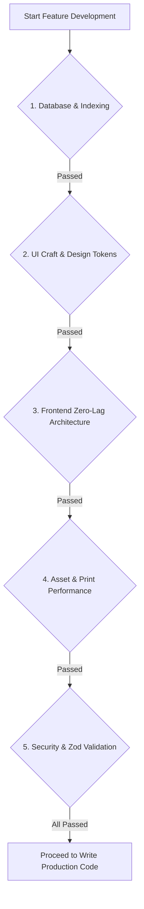

# 🚦 07. Mandatory Developer Checklist & Chat Verification Rules

> **CRITICAL INSTRUCTION FOR ALL AI AGENTS & DEVELOPERS**  
> Before generating code or starting any feature implementation for **Crystal Press**, you **MUST verify compliance** against every item in this checklist.

---

## 📋 Session Pre-Flight Checklist



---

### 1. Database & Indexing Rules (`02_DATABASE_ARCHITECTURE.md`)
- [ ] **No Unindexed Wildcard Queries**: Never use raw `LIKE '%term%'` without the `pg_trgm` GIN index. Search queries on product name/SKU/barcode must hit `products_name_trgm_idx` or B-Tree indexes.
- [ ] **Atomic Concurrency for Checkout**: Stock deductions must be executed within `prisma.$transaction` using optimistic concurrency checks (`currentStock: { gte: quantity }`).
- [ ] **Soft Filtering with Partial Indexes**: Only active products (`WHERE is_active = true`) and active job orders (`WHERE status NOT IN ('DELIVERED', 'CANCELLED')`) should be queried on hot operational paths.
- [ ] **Customer Balance Integrity**: Every credit/Udhaar transaction must write to both `Customer.currentBalance` and `CustomerLedger` atomically in the same transaction block.

---

### 2. UI/UX Craft & Non-AI Aesthetics (`03_UI_UX_DESIGN_SYSTEM.md`)
- [ ] **No Generic "AI Templates"**: Reject default indigo/blue cookie-cutter layouts. Use the curated **Soft Lime (`#D9F99D` / `#84CC16`) + Slate (`#0F172A` / `#F8FAFC`)** palette inspired by the executive dashboard aesthetic.
- [ ] **High Card Radius & Subtle Borders**: All dashboard panels and container cards must use `rounded-3xl` or `rounded-2xl` with micro-borders (`border-slate-100` / `border-slate-200/60`).
- [ ] **Custom Status Badge Pills**: Status badges must render as pill shapes with distinct soft-tint backgrounds and circular dot indicators (`StatusBadge` component).
- [ ] **Clear Typographic Hierarchy**: Large bold numbers (`text-3xl font-bold tracking-tight text-slate-900`), uppercase micro-labels (`text-xs font-semibold text-slate-400 uppercase tracking-wider`).
- [ ] **Counter POS Target Sizing**: In Counter POS mode, all action buttons (Cash, UPI QR, Complete Bill) must have a minimum touch target height of `52px` with high contrast.

---

### 3. Frontend Zero-Lag Protocols (`04_FRONTEND_PERFORMANCE.md`)
- [ ] **Zero Network Roundtrips on Cart Edits**: Cart additions, removals, quantity updates, and discount calculations must run **100% in-memory via Zustand** (`usePOSStore`). No API calls until checkout submission.
- [ ] **Virtualization for 1,500+ SKUs**: Product catalog tables and grids must use `@tanstack/react-virtual` to render only the 15–20 visible items in the DOM.
- [ ] **Hardware Barcode Wedge Listener**: Global keyboard capture (`useBarcodeScanner`) must catch rapid HID scanner bursts (< 35ms cadence) regardless of which element is focused.
- [ ] **Keyboard-First Shortcuts**: Standard POS shortcuts must be active (`F2`: Product Search, `F4`: Customer Select, `F7`: Hold Bill, `F8`: Pay / Checkout, `F9`: Quick Print).
- [ ] **Client-Side Query Caching**: Static/master catalogs must utilize TanStack Query v5 with IndexedDB persistence for instantaneous offline-resilient startup.

---

### 4. Asset & Print Engine Standards (`05_ASSET_AND_PRINT_OPTIMIZATION.md`)
- [ ] **No Heavy PDF Runtime for Thermal Receipts**: 80mm/58mm counter receipts must be generated using the lightweight hidden iframe `@media print` engine (< 50ms trigger time).
- [ ] **Client-Side Image Pre-Compression**: Job order customer artwork (visiting cards, banners, proofs) must be converted into an 800px WebP preview blob via Canvas API before upload.
- [ ] **Server-Side Sharp Processing**: All uploaded shop logos and product images must be stripped of metadata and converted to optimized WebP/AVIF formats.

---

### 5. API, Security & Validation Standards (`06_API_AND_INTEGRATIONS.md`)
- [ ] **Strict Zod Input Validation**: Every Server Action and API Route Handler must validate incoming payloads against a strict Zod schema.
- [ ] **Role-Based Authorization (RBAC)**: Cashiers must be blocked from modifying product prices, deleting invoices, or viewing store profit reports.
- [ ] **Comprehensive Audit Trail**: Every price override, invoice cancellation, discount entry, or stock adjustment must record an entry in `AuditLog`.
- [ ] **NPCI Compliant UPI QR**: Dynamic UPI QR codes must generate valid `upi://pay?pa=...` URIs with the exact invoice amount and reference.

---

### 6. Zero HTTP & Client-Side Error Mandate & Self-Correction Rule
- [ ] **No HTTP Status Code Errors**: In every chat and for every file created or altered, there must be **no HTTP 400, 401, 402, 403, 500 or other errors**.
- [ ] **Strict React Rules of Hooks (Zero Client-Side Exceptions)**: All React hooks (`useState`, `useEffect`, `useMemo`, `useCallback`, `useRef`, custom hooks) must be declared unconditionally at the very top of functional components. Never place hooks after early returns (`if (!isOpen) return null;`) or inside conditionals to prevent Minified React Error #300, #310, #321.
- [ ] **Mandatory Error Verification in Every Chat**: Every endpoint, action, route handler, and page modified or created must be checked for runtime crashes, unhandled rejections, invalid parameters, authentication/authorization failures, client-side exceptions, and server errors.
- [ ] **Immediate Self-Correction**: If any error (400, 401, 402, 403, 500, or client/server crash) is identified or occurs during development, testing, or review, **you must immediately fix it, make it right, audit all related components to ensure no other occurrences exist, and verify that the fix resolves the issue** before completing the turn.

---

## 🔍 Verification Protocol for Each Chat Step

When generating or reviewing code in any chat session, perform this self-audit:

```text
[ ] 1. Did I check 01_PROJECT_SPECIFICATION.md for business rules?
[ ] 2. Does the schema match 02_DATABASE_ARCHITECTURE.md?
[ ] 3. Does the UI adhere to the custom soft-lime/slate style in 03_UI_UX_DESIGN_SYSTEM.md?
[ ] 4. Is the frontend latency-free as per 04_FRONTEND_PERFORMANCE.md?
[ ] 5. Are media/print operations lightweight as per 05_ASSET_AND_PRINT_OPTIMIZATION.md?
[ ] 6. Are Server Actions protected and validated as per 06_API_AND_INTEGRATIONS.md?
[ ] 7. Are all React Hooks placed unconditionally at the top of components (zero client exceptions / #310 errors)?
[ ] 8. Have I verified that NO errors (400, 401, 402, 403, 500, or UI crashes) occur in files created or modified, and immediately fixed any found?
```

